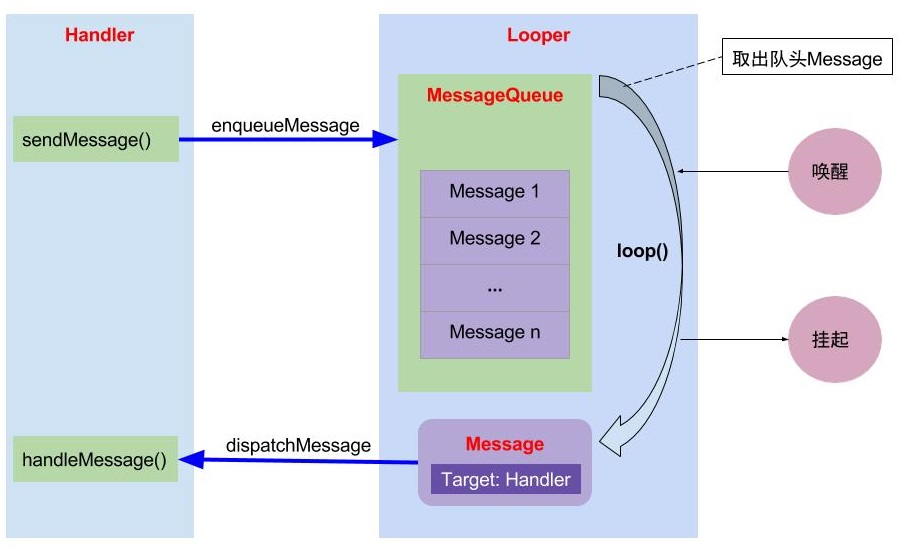

## 一、前言

Handler 在我们日常开发中随处可见，一般用来解决子线程无法访问主线程（UI 线程）中的 UI 问题的。

下文会通过 Handler 的基本用法，并深入源码浅析 Handler 的运行机制。

<!--more-->

## 二、Handler 基本用法

首先，我们先来简单过一下 Handler 的几种用法。

第一种：主线程实例化一个 Handler 并重写 `handleMessage` 方法，然后在需要的时候调用 `send` 或 `post ` 等系列方法就行。此时 `handleMessage` 和  `Runnable`  运行在主线程。

```kotlin
//主线程
val handler: Handler = object : Handler() {
    override fun handleMessage(msg: Message?) {
        super.handleMessage(msg)
        //do something
    }
}
//子线程发送消息
Thread {
    //第一种用法：子线程发送 msg
    val msg: Message = handler.obtainMessage()
    handler.sendMessage(msg)

    //第二种用法：post
    handler.post {
        //主线程
    }
}.start()
```

第二种：在子线程实例化 Handler，需要注意是在实例化之前要先创建 Looper，否则会抛出 `Can't create handler inside thread...` 异常。创建 Looper 有两种方式，一是调用 ` Looper.prepare()` ，此时 Handler 运行在子线程中；二是调用 `Looper.getMainLooper()` 得到 Looper 并作为实例化 Handler 时构造函数的参数，此时 Handler 运行在主线程。

```kotlin
//handler 运行在子线程
var handler: Handler
Thread {
    Looper.prepare()
    handler = object : Handler() {
        override fun handleMessage(msg: Message?) {
            super.handleMessage(msg)

        }
    }
    Looper.loop()
}.start()

//handler 运行在主线程
Thread {
    val looper = Looper.getMainLooper()
    handler = object : Handler(looper) {
        override fun handleMessage(msg: Message?) {
            super.handleMessage(msg)

        }
    }
}.start()
```

通过这两种简单的使用，如果我们进一步想的话，会产生几个疑问，比如：

1. **为啥在子线程需要调用 `Looper.prepare()` 等方式而主线程却不需要？**
2. **`send` 和 `post` 之后做了什么处理，`handleMessage` 什么时候接收到消息？**
3. **常常听说的 MessageQueue 到哪去了？**
4. **Handler 是如何保证所在的运行线程的，线程又是如何切换的？**

接下来，让我们一起进入源码的世界来一一解开这些疑惑。

## 三、Handler 源码浅析

> 注：基于 Android SDK 28 进行解析。涉及到的代码会做简化处理，只保留关键部分的代码。

先说一下本篇文章阅读源码的顺序，先看看 Handler 实例化过程中做哪些初始化操作，然后 `send` 和 `post` 之后又是将 Message 发送给谁，之后的流程又是怎样，同时在阅读过程中来解答上一节的疑问。

### 3.1 Handler 实例化

在跟进 Handler 的构造方法之后，我们会发现 Handler 在实例化时会为三个属性赋值：

1. 第一个是 `mLooper` 通过 `Looper.myLooper()` 取值，同时检查 Looper 是否为空，为空时抛出异常；
2. 第二个是 `mQueue` 这个就是我们心心念念的 MessageQueue，可以发现它是由 Looper 持有的，具体的解析看下一节【**Message 管理与分发**】；
3. 还有个是 `mCallback` ，这个相关解析可以看下一节【**Message 管理与分发**】。

```java
//Handler.java
public Handler(Callback callback, boolean async) {
    //...省略了部分代码，后续看到 //... 这个就代表简略了代码
    mLooper = Looper.myLooper();
    if (mLooper == null) {
        throw new RuntimeException(
            "Can't create handler inside thread " + Thread.currentThread()
                    + " that has not called Looper.prepare()");
    }
    mQueue = mLooper.mQueue;
    mCallback = callback;
}
```

构造方法中其实没有太多的东西，接下来我们看看 `Looper.myLooper()` 是如何获取到 Looper 实例的。

```java
//Looper.java
public static @Nullable Looper myLooper() {
    return sThreadLocal.get();
}
```

很简单，通过 `ThreadLocal.get()` 获取，既然有 `get` 那么肯定有对应的 `set` 方法，那在什么地方 set 呢？

这时候我们就要回想一下，在子线程中使用 Handler 是有三个步骤的：

```
1. Looper.prepare()
2. var handler: Handler = Handler()
3. Looper.loop()
```

我们此时是在第 2 中，那 `ThreadLocal.set()` 的设置是不是在 `Looper.prepare()` 中呢。

```java
//Looper.java
private static void prepare(boolean quitAllowed) {
    if (sThreadLocal.get() != null) {
        throw new RuntimeException("Only one Looper may be created per thread");
    }
    sThreadLocal.set(new Looper(quitAllowed));
}

private Looper(boolean quitAllowed) {
    mQueue = new MessageQueue(quitAllowed);
    mThread = Thread.currentThread();
}
```

毫无疑问，是的。

这时我们就可以得到一个小小结论：Looper 提供一个 `Looper.prepare()` 方法来创建 Looper 对象，并将该对象放到 ThreadLocal 中，等 Handler 实例化的时候取出该 Looper 实例。

那 ThreadLocal 又是什么，怎么保证 Handler 实例化获取的 Looper 正好是我们创建的那个呢？

**ThreadLocal：线程本地存储区（Thread Local Storage）,每个线程都有自己的私有的本地存储区域，不同线程之间彼此不能访问对方的本地存储区。**

有个 ThreadLocal 概念之后，接下来看看 `ThreadLocal.set()` 做了哪些处理。

> 注：这边的泛型 T 指的是 Looper 类型

```java
//ThreadLocal.java
public void set(T value) {
    Thread t = Thread.currentThread();
    ThreadLocalMap map = getMap(t);
    if (map != null)
        map.set(this, value);
    else
        createMap(t, value);
}

ThreadLocalMap getMap(Thread t) {
    return t.threadLocals;
}

void createMap(Thread t, T firstValue) {
    t.threadLocals = new ThreadLocalMap(this, firstValue);
}
```

从上面的代码，我们可以发现 ThreadLocal 内部通过一个 ThreadLocalMap 键值对来保存 Looper 实例，同时这个 Map 保存在当前线程中。

再来看看 `ThreadLocal.get()` 。

```java
//ThreadLocal.java
public T get() {
    Thread t = Thread.currentThread();
    ThreadLocalMap map = getMap(t);
    if (map != null) {
        ThreadLocalMap.Entry e = map.getEntry(this);
        if (e != null) {
            @SuppressWarnings("unchecked")
            T result = (T)e.value;
            return result;
        }
    }
    return setInitialValue();
}

ThreadLocalMap getMap(Thread t) {
    return t.threadLocals;
}
```

可以发现，获取 Looper 实例时也是先从当前线程中先获取 ThreadLocalMap，再根据当前 ThreadLocal 对象作为 key 来获取对应的 Looper 实例。

通过 ThreadLocal 的 `set` 和 `get` 方法，我们可以比较清晰的发现在 Handler 当中：ThreadLocal 是用来实现 Thread 和 Looper 的关联的。

经过上面的分析，我们现在就可以来解答【**疑问 1**】（为啥在子线程需要调用 `Looper.prepare()` 等方式而主线程却不需要？）：**在 Handler 实例化中会调用 `Looper.myLooper()` 获取 Looper 实例对象，然而此对象最终是保存在当前线程的 ThreadLocalMap 中的，如果在 Handler 实例化之前不先调用 `Looper.prepare()` 来创建对应的 Looper 实例，那么 `Looper.myLooper()` 获取到的是一个 `null` 值，这就会导致在检测 `mLooper` 是否为空时抛出异常。**

因此我们可以得出这么一个结论：**在任意一个线程中要实例化 Handler 必须要先调用 `Looper.prepare()`  来优先创建 Looper 保证当前线程中有一个 Looper 实例，否则就会抛异常。**

这时，细心的你会说，这个结论不对啊，为什么主线程使用 Handler 就不用调用 `Looper.prepare()`  呢？

确实我们在主线程使用 Handler 的时候并没有做额外的创建 Looper 工作，那主线程难道就是一个特殊的线程，就可以不用创建一个 Looper 实例吗？其实并不是的，主线程也不例外，为什么呢，那是因为 ActivityThread。

通常我们认为 ActivityThread 就是主线程也可以说是 UI 线程，但其实它并不是一个线程，而是主线程操作的一个管理者，认为它是主线程也是可以的。ActivityThread 中的有个 `main()` 方法它是 APP 的入口。

```java
//ActivityThread.java
public static void main(String[] args) {
    //...    
    Looper.prepareMainLooper();
    //...
    ActivityThread thread = new ActivityThread();
    thread.attach(false, startSeq);

    if (sMainThreadHandler == null) {
        sMainThreadHandler = thread.getHandler();
    }
    //...    
    Looper.loop();

    throw new RuntimeException("Main thread loop unexpectedly exited");
}
```

```java
//Looper.java
public static void prepareMainLooper() {
    prepare(false);
    synchronized (Looper.class) {
        if (sMainLooper != null) {
            throw new IllegalStateException("The main Looper has already been prepared.");
        }
        sMainLooper = myLooper();
    }
}
```

可以看到在 **ActivityThread 的 `main()` 方法中调用了 `Looper.prepareMainLooper()` 创建了属于主线程的 Looper，因此我们就可以在主线程中直接使用 Handler。**

### 3.2 Message 管理与分发

在【**Handler 基本用法**】中可以发现消息是通过 `sendMessage()` 和 `post()` 来发送的，但其实 Handler 提供了  `send` 和 `post` 为开头的一系列方法。

跟进代码之后，我们会发现其实这系列的方法最终都会走到 `Handler().enqueueMessage()` 方法中。比如：

```
//Handler.java
sendMessage(Message msg)
 -> sendMessageDelayed(Message msg, long delayMillis)
  -> sendMessageAtTime(Message msg, long uptimeMillis)
   -> enqueueMessage(MessageQueue queue, Message msg, long uptimeMillis)
```

**`post` 虽然参数是 Runnable 但最终也是一个 Message。**

```java
//Handler.java
public final boolean post(Runnable r){
   return  sendMessageDelayed(getPostMessage(r), 0);
}

private static Message getPostMessage(Runnable r) {
    Message m = Message.obtain();
    m.callback = r;
    return m;
}
```

我们来详细看下 `Handler().enqueueMessage()` 的方法。

```java
//Handler.java
private boolean enqueueMessage(MessageQueue queue, Message msg, long uptimeMillis) {
    msg.target = this;
    if (mAsynchronous) {
        msg.setAsynchronous(true);
    }
    return queue.enqueueMessage(msg, uptimeMillis);
}
```

可以发现 MessageQueue 在这里又出现，在前面【**Handler 实例化**】中出现了两次，一次是在初始化 Handler 的时候通过 `mLooper.mQueue` 进行赋值，另一次是在 Looper 初始化中创建了 MessageQueue 的对象。

**MessageQueue 顾名思义是一个消息队列，负责消息的入队出队。内部是一个单链表。**

这个方法比较简单，主要是调用 `queue.enqueueMessage` 对消息进行了入队处理，需要注意的是 `msg.target = this` 这个后面解析会使用到，先记着。

我们接着往下跟 `MessageQueue.enqueueMessage()` ，看看消息是如何添加到队列中的。

```java
//MessageQueue.java
boolean enqueueMessage(Message msg, long when) {
    if (msg.target == null) {
        throw new IllegalArgumentException("Message must have a target.");
    }
    if (msg.isInUse()) {
        throw new IllegalStateException(msg + " This message is already in use.");
    }
    synchronized (this) {
        if (mQuitting) {
            msg.recycle();
            return false;
        }
        msg.markInUse();
        msg.when = when;
        Message p = mMessages;
        boolean needWake;
        if (p == null || when == 0 || when < p.when) {
            // New head, wake up the event queue if blocked.
            msg.next = p;
            mMessages = msg;
            needWake = mBlocked;
        } else {
            // Inserted within the middle of the queue.  Usually we don't have to wake
            // up the event queue unless there is a barrier at the head of the queue
            // and the message is the earliest asynchronous message in the queue.
            needWake = mBlocked && p.target == null && msg.isAsynchronous();
            Message prev;
            for (;;) {
                prev = p;
                p = p.next;
                if (p == null || when < p.when) {
                    break;
                }
                if (needWake && p.isAsynchronous()) {
                    needWake = false;
                }
            }
            msg.next = p; // invariant: p == prev.next
            prev.next = msg;
        }
        // We can assume mPtr != 0 because mQuitting is false.
        if (needWake) {
            nativeWake(mPtr);
        }
    }
    return true;
}
```

这段代码虽然看起来有点长，但逻辑还是很清晰的，这里就不一一解释。可以发现**MessageQueue 是一个按照 Message 触发时间（`when` 的大小）的先后顺序排序的，队头是最早要触发的消息。因此当一个消息要进入队列的时候，会从头开始开始遍历，直到找到该消息合适的插入位置，来保证整个队列消息的时间顺序**。

到这里我们已经清楚的知道，Handler `send` 或 `post` 消息之后是由 MessageQueue 按照时间顺序来存储 Message 的，那 Message 又是何时由谁来触发的呢？

说到这里，我们就要先回顾一下，线程使用 Handler 的三个步骤：

```
1. Looper.prepare()
2. var handler: Handler = Handler()
3. Looper.loop()
```

在此之前我们已经解析了 1、2 两个步骤，那 `Looper.loop()` 这个方法是不是用来分发 Message 的呢？

```java
//Looper.java
public static void loop() {
    final Looper me = myLooper();
    if (me == null) {
        throw new RuntimeException("No Looper; Looper.prepare() wasn't called on this thread.");
    }
    final MessageQueue queue = me.mQueue;
    //...
    for (;;) {
        Message msg = queue.next(); // might block
        if (msg == null) {
            // No message indicates that the message queue is quitting.
            return;
        }
        //...
        try {
            msg.target.dispatchMessage(msg);
            dispatchEnd = needEndTime ? SystemClock.uptimeMillis() : 0;
        } finally {
            //...
        }
        //...
        msg.recycleUnchecked();
    }
}
```

可以发现，`Looper.loop()` 确实用来分发 Message 的。进入 `loop` 之后会有个 for 的无限循环，在这个循环当中，**首先从 MessageQueue 中读取下一条 Message，然后将 Message 分发给对应的 `target` 处理，最后将该 Message 回收到消息池方便复用，不断的重复以上三个步骤，直到没有消息时退出循环**。

接着我们看看 `queue.next()` 到底如何读取 Message 的，同时这边还有个注释 `might block （可能阻塞）`，一起看看到底怎么回事。

```java
//MessageQueue.java
Message next() {
    //...
    int pendingIdleHandlerCount = -1; // -1 only during first iteration
    int nextPollTimeoutMillis = 0;
    for (;;) {
        if (nextPollTimeoutMillis != 0) {
            Binder.flushPendingCommands();
        }
        //阻塞操作，等待 nextPollTimeoutMillis 时长或者消息队列被唤醒时会返回，是一个 native 方法
        nativePollOnce(ptr, nextPollTimeoutMillis);

        synchronized (this) {
            // Try to retrieve the next message.  Return if found.
            final long now = SystemClock.uptimeMillis();
            Message prevMsg = null;
            Message msg = mMessages;
            //...
            if (msg != null) {
                if (now < msg.when) {
                    // Next message is not ready.  Set a timeout to wake up when it is ready.
                    nextPollTimeoutMillis = (int) Math.min(msg.when - now, Integer.MAX_VALUE);
                } else {
                    // Got a message.
                    mBlocked = false;
                    if (prevMsg != null) {
                        prevMsg.next = msg.next;
                    } else {
                        mMessages = msg.next;
                    }
                    msg.next = null;
                    msg.markInUse();
                    return msg;
                }
            } else {
                // No more messages.
                nextPollTimeoutMillis = -1;
            }

            // Process the quit message now that all pending messages have been handled.
            if (mQuitting) {
                dispose();
                return null;
            }

        // Run the idle handlers.
        // ... 关于 IdleHandler 可以在 [四、Handler 扩展] 中查看
    }
}
```

这里面有个 `nativePollOnce()` 的 native 的阻塞操作，`nextPollTimeoutMillis` 是指阻塞的时长，当 `nextPollTimeoutMillis = -1` 时代表此时消息队列中没有消息，会一直等待下去。**可以发现延时消息就是在这里实现的。**

关于阻塞还有个问题，通过代码可以知道 `Looper.loop()` 内部是一个死循环，那么它为什么不会卡死呢？这个问题的答案可以查看 【**六、参考与推荐 1 **】的文章。

看完  `queue.next()` 消息的读取，接下来来看看 `msg.target.dispatchMessage(msg)` ，这里的 `target` 是一个 Handler 是否还记得呢，在  `Handler().enqueueMessage()`  消息入队之前会将当前 Handler 对象赋值给 `Message.target` 。

```java
//Handler.java
public void dispatchMessage(Message msg) {
    if (msg.callback != null) {
        handleCallback(msg);
    } else {
        if (mCallback != null) {
            if (mCallback.handleMessage(msg)) {
                return;
            }
        }
        handleMessage(msg);
    }
}

private static void handleCallback(Message message) {
    message.callback.run();
}

/**
 * Subclasses must implement this to receive messages.
 */
public void handleMessage(Message msg) {
}
```

消息分发流程：

1. 当 Message.callback 不为空时，回调  message.callback.run() 方法，其中 callback 的类型是 Runnable 类型，当你使用 Handler.post 系列方法时候，就会调用；如果 Message.callback 为空进入流程 2。
2. 如果 Handler.mCallback 不会空则先调用 mCallback.handleMessage(msg)，否则进入流程 3。注意：若 mCallback.handleMessage(msg) 返回 true，整个流程到此为止。
3. 最后，调用 Handler 自身的 handleMessage() 方法，该方法为空实现需要子类覆写。

至此，我们已经完成从 Handler.send() 发送消息开始到最后 Handler 接收并处理消息的整体流程的解析，同时也在这个过程中解答了【**疑问 2、3**】。

那还有最后一个疑问，Handler 是如何线程切换的呢？

注：原先想按照自己的思路描述，但写完之后发现不够简洁，因此在这里引用了【**六、参考与推荐 3**】文章中描述。

很多人搞不懂这个原理，但是其实非常简单，我们将所涉及的方法调用栈画出来，如下：

 ```
 Thread {
 	Looper.loop()
 	 -> MessageQueue.next()
  	  -> Message.target.dispatchMessage()
  	   -> Handler.handleMessage()
 }
 ```

**显而易见，Handler.handleMessage() 所在的线程最终由调用 Looper.loop() 的线程所决定。**

平时我们用的时候从异步线程发送消息到 Handler，这个 Handler 的 `handleMessage()` 方法是在主线程调用的，所以消息就从异步线程切换到了主线程。

## 四、Handler 扩展

### 4.1 IdleHandler

IdleHandler 简单来说就是一个接口，只不过它在 Handler 当中仅仅会在消息空闲的时候执行。

```java
//MessageQueue.java
public static interface IdleHandler {
    boolean queueIdle();
}
```

调用执行的代码在 `MessageQueue.next()` 方法中，如下：

```java
//MessageQueue.java
Message next() {
		//...
    int pendingIdleHandlerCount = -1; // -1 only during first iteration
    int nextPollTimeoutMillis = 0;
    for (;;) {
        //...

        synchronized (this) {
            //...

            // If first time idle, then get the number of idlers to run.
            // Idle handles only run if the queue is empty or if the first message
            // in the queue (possibly a barrier) is due to be handled in the future.
            if (pendingIdleHandlerCount < 0
                    && (mMessages == null || now < mMessages.when)) {
                pendingIdleHandlerCount = mIdleHandlers.size();
            }
            if (pendingIdleHandlerCount <= 0) {
                // No idle handlers to run.  Loop and wait some more.
                mBlocked = true;
                continue;
            }

            if (mPendingIdleHandlers == null) {
                mPendingIdleHandlers = new IdleHandler[Math.max(pendingIdleHandlerCount, 4)];
            }
            mPendingIdleHandlers = mIdleHandlers.toArray(mPendingIdleHandlers);
        }

        // Run the idle handlers.
        // We only ever reach this code block during the first iteration.
        for (int i = 0; i < pendingIdleHandlerCount; i++) {
            final IdleHandler idler = mPendingIdleHandlers[i];
            mPendingIdleHandlers[i] = null; // release the reference to the handler

            boolean keep = false;
            try {
                keep = idler.queueIdle();
            } catch (Throwable t) {
                Log.wtf(TAG, "IdleHandler threw exception", t);
            }

            if (!keep) {
                synchronized (this) {
                    mIdleHandlers.remove(idler);
                }
            }
        }

        // Reset the idle handler count to 0 so we do not run them again.
        pendingIdleHandlerCount = 0;

        // While calling an idle handler, a new message could have been delivered
        // so go back and look again for a pending message without waiting.
        nextPollTimeoutMillis = 0;
    }
}
```

## 五、总结

最后，我们结合图片来尝试对 Handler 做个总结。

> 图片来源【**六、参考与推荐 2**】




* Looper：不断的执行循环（`Looper.loop()`）从持有的 MessageQueue 队列中读取 Message （`MessageQueue.next()`），分发给对应的 Handler 处理；
* MessageQueue：消息队列，通过 `MessageQueue.enqueueMessage()` 方法对从 Handler 发送过来的 Message 进行入队存储。
* Handler：消息辅助类，负责发送和处理 Message。

简单一句话概括：**Handler 通过 sendMessage() 发送 Message 到 MessageQueue 队列中，并由 Looper 通过 loop() 不断循环从 MessageQueue 中读取 Message，将其通过 Message.target.dispatchMessage() 交给 Handler 处理。**

## 六、参考与推荐

1. [Android 中为什么主线程不会因为 Looper.loop() 里的死循环卡死](https://www.zhihu.com/question/34652589/answer/90344494)
2. [Android消息机制1-Handler（Java 层）](http://gityuan.com/2015/12/26/handler-message-framework/)
3. [Handler 都没搞懂，拿什么去跳槽啊](https://juejin.im/post/5c74b64a6fb9a049be5e22fc#heading-0)
