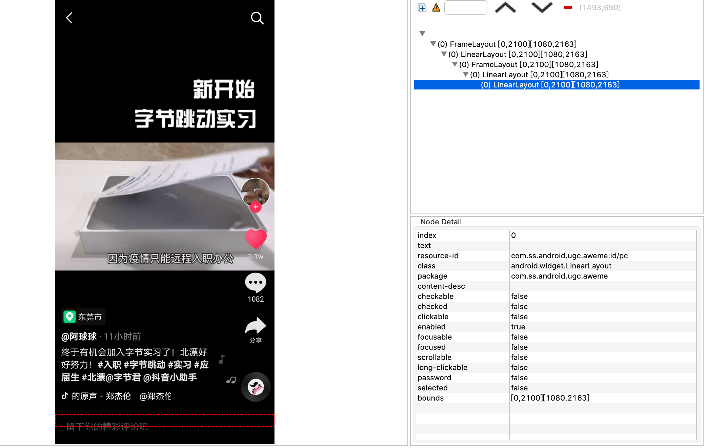

最近有想在抖音上发布视频，不想再注册个新号，但原来的账号之前在抖音上点赞了好多视频，个人主页中喜欢有将近 1 千个，不太喜欢，想当一个新号来使用的话，必须将这些喜欢取消掉。

手动取消的话，感觉特别麻烦，讨厌重复性的动作。网上搜了一圈，基本没找到自动取消的方案，实在是没撤了，作为一个开发者，最后只能自己动手丰衣足食了。

初步一想，有两种方案：
1. 找到抖音的请求接口，批量循环一遍。
2. 在手机上模拟点击操作。

<!--more-->

方案 1 的话如果能找到对应接口的话是最快的，麻烦点在于需要寻找接口以及能找到之后接口请求各种验证，相对于方案 2 于我来说相对麻烦不少（作为一个 Android 开发者），所以我只能放弃方案 1 选择方案 2 了。

在 Android 上想模拟点击操作，毫无疑问只能使用无障碍服务，比如之前很火的微信自动抢红包，也是使用这种方式，当然 xposed 也是可以，但我实在不懂啊😂。无障碍模拟点击通俗来讲，就是在当前界面中找到需要点击的视图，比如我们现在要做的抖音喜欢按钮，找到视图之后通过模拟点击方法触发点击事件。

接下来就开始我们的工程，首先是配置项目，找到抖音的包名，使得无障碍服务仅监听抖音的事件，免得手机卡顿。最重要的是继承 `AccessibilityService` 类来监听页面变化等事件，具体过程看看 Android 开发官网或者网上的教程都挺多的，就不在这里赘述。

然后，用开发工具 Monitor 查看抖音的布局，找到喜欢相关视图，

根据上图，可以找到喜欢的视图和它的 id，这个主要是用来定位是不是在个人主页喜欢的 tab 下面，然后通过 `AccessibilityNodeInfo.findAccessibilityNodeInfosByText("喜欢")` 来找到对应的结点，不用 id 的原因是兼容，不同版本的抖音 id 是不一样的。

确认在个人主页之后，就要找到视频 item，

同样通过 `AccessibilityNodeInfo.findAccessibilityNodeInfosByText("视频")` 找到对应结点，然后通过 `performAction(AccessibilityNodeInfo.ACTION_CLICK)` 模拟点击，就会跳转到视频的详情页面。

在上图，可以发现在视频详情页，根本找不到任何结点让我们模拟点击，也就是说通过找到视图结点模拟操作在这个界面根本无法做到！

怎么办？

只能回去翻翻官方文档，可以发现一个属性 `android:canPerformGestures="true"`，这样子就可以在手机上模拟手势操作了，需要注意的是，这个属性仅支持 Android 7.0 及其以上的版本。

设置上面的属性，在 `AccessibilityService` 中我们就可以调用一个方法 `dispatchGesture(GestureDescription,GestureResultCallback,Handler)`，这个方法主要是根据屏幕的坐标点模拟手势操作，当然也包括点击。

所以，此时就得找到抖音视频页面喜欢按钮在屏幕上的坐标，由于不同手机坐标点肯定不一样，因此没办法是一个固定值，通过屏幕百分比的话，有一定的可行性，但不能保证百分百。因此想了另一个方案，通过悬浮窗手动定位到按钮位置。

最后，在处理一下细节，基本上就成型了。

最后在手机上安装运行验证一下，1 千左右全部取消基本在 10 分钟以内完成，时间还行，不过为了写这个程序花了我周末一个白天😂。
